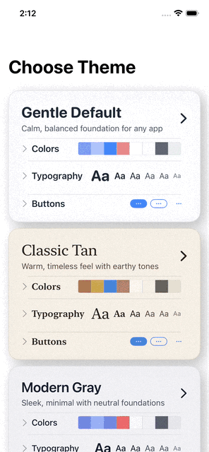

[](https://github.com/gentle-giraffe-apps/GentleDesignSystem/actions/workflows/ci.yml)
[](https://codecov.io/gh/gentle-giraffe-apps/GentleDesignSystem)
[](https://swift.org)


[](https://deepsource.io/)
[](https://app.deepsource.com/gh/gentle-giraffe-apps/GentleDesignSystem/)


> 🌍 **言語** · 正式ドキュメントは英語 · [English](../README.md) · [Español](README.es.md) · [Português (Brasil)](README.pt-BR.md)

### 概要

統一されたデザインシステムで、テキスト、ボタン、サーフェスを素早く標準化できます。

```swift
Text("シンプルな修飾子")
    .gentleText(.title_xl)

Button("アプリ全体で使える") { }
    .gentleButton(.primary)

VStack {
    Text("時間を大幅に節約")
}
.gentleSurface(.card)
```

### 対象

長期的なテーマの進化を見据えた、堅実なSwiftUI基盤を求めるアプリ向け。

💬 **[ディスカッションに参加してください。フィードバックや質問を歓迎します](https://github.com/gentle-giraffe-apps/GentleDesignSystem/discussions)**


**実際に試す:** `Demo/GentleDesignSystemDemo.xcodeproj` を開いてコンポーネントを探索できます。デモアプリでは、システムの共有シートを使ってJSON仕様の編集・共有も可能です。

---

## クイックスタート

### 1. パッケージを追加

```swift
.package(url: "https://github.com/gentle-giraffe-apps/GentleDesignSystem.git", from: "0.1.7")
```

### 2. アプリのルートをラップ

```swift
import GentleDesignSystem

@main
struct MyApp: App {
    var body: some Scene {
        WindowGroup {
            GentleThemeRoot(theme: .default) {
                ContentView()
            }
        }
    }
}
```

### 3. コンポーネントを使用

#### タイポグラフィ
```swift
Text("ようこそ")
    .gentleText(.title_xl)

Text("説明文")
    .gentleText(.body_m, colorRole: .textSecondary)
```

#### ボタン
```swift
Button("続ける") { }
    .gentleButton(.primary)

Button("キャンセル") { }
    .gentleButton(.secondary)
```

#### サーフェス
```swift
VStack {
    Text("カードのコンテンツ")
}
.gentleSurface(.card)
```

---

## 品質とツール

<details>
  <summary><strong>CI、静的解析、カバレッジの詳細</strong></summary>

  このプロジェクトはCIと静的解析を通じて品質を担保しています：

  - **CI:** `main` へのすべてのコミットはGitHub Actionsのチェックを通過する必要があります
  - **静的解析:** DeepSourceがすべてのコミットで実行されます
  - **テストカバレッジ:** Codecovが行カバレッジをレポートします

  <sub><strong>Codecovスナップショット</strong></sub><br/>
  <a href="https://codecov.io/gh/gentle-giraffe-apps/GentleDesignSystem">
    
  </a>

</details>

---

## アーキテクチャ概要

GentleDesignSystemは意図的に**3つのレイヤー**で構成されています：

1. **トークン定義（Codable、JSON互換）**
2. **ランタイム解決（テーマ + Environment）**
3. **SwiftUIエルゴノミクス（修飾子と拡張）**

この分離により、デザインの意図が明確になり、ランタイムの動作が予測可能になり、将来の進化が安全になります。

<details>
  <summary><strong>システムアーキテクチャ（図）</strong></summary>

  ```mermaid
  flowchart TB
      subgraph Tokens["トークンレイヤー（デザイン時）"]
          Spec[GentleDesignSystemSpec]
          Spec --> Colors[GentleColorTokens]
          Spec --> Typography[GentleTypographyTokens]
          Spec --> Layout[GentleLayoutTokens]
          Spec --> Visual[GentleVisualTokens]
          Spec --> Buttons[GentleButtonTokens]
          Spec --> Surfaces[GentleSurfaceTokens]
      end

      subgraph Runtime["ランタイムレイヤー"]
          Theme[GentleTheme]
          Manager[GentleThemeManager]
          Store[GentleFileThemeSpecStore]
          Manager --> Theme
          Store -.->|読み込み/保存| Manager
      end

      subgraph SwiftUI["SwiftUIレイヤー"]
          Root[GentleThemeRoot]
          Env[Environment Values .gentleTheme]
          Modifiers[ビュー修飾子]
          Root --> Env
          Env --> Modifiers
      end

      Tokens --> Runtime
      Runtime --> SwiftUI
  ```
</details>

<details>
  <summary><strong>データフロー（図）</strong></summary>

  ```mermaid
  flowchart TB
      JSON[(JSONファイル)] -->|読み込み| Store[GentleFileThemeSpecStore]
      Store --> Manager[GentleThemeManager]
      Manager --> Theme[GentleTheme]
      Theme --> Resolve{解決}

      Resolve -->|ColorScheme| ResolvedColor[カラー]
      Resolve -->|ContentSizeCategory| ResolvedFont[フォント]

      ResolvedColor --> View[SwiftUI View]
      ResolvedFont --> View

      View -->|.gentleText| Text
      View -->|.gentleButton| Button
      View -->|.gentleSurface| Surface
  ```
</details>

<details>
  <summary><strong>データモデル（仕様構造）</strong></summary>

  デザインシステムは単一のJSON互換仕様（`GentleDesignSystemSpec`）で定義されています。

  ```text
  GentleDesignSystemSpec
│
├── colors: GentleColorTokens
│       │
│       └── pairByRole: [String: GentleColorPair]
│               │
│               ├── キー = GentleColorRole.rawValue
│               └── 値 = GentleColorPair
│                       ├── lightHex: String
│                       └── darkHex:  String
│
├── typography: GentleTypographyTokens
│       │
│       └── roles: [String: GentleTypographyRoleSpec]
│               │
│               ├── キー = GentleTextRole.rawValue
│               └── 値 = GentleTypographyRoleSpec
│                       ├── pointSize: Double
│                       ├── weight: GentleFontWeightToken
│                       ├── design: GentleFontDesignToken
│                       ├── width:  GentleFontWidthToken?
│                       ├── relativeTo: GentleFontTextStyle
│                       ├── lineSpacing: Double
│                       ├── letterSpacing: Double
│                       ├── isUppercased: Bool
│                       └── colorRole: GentleColorRole
│
├── layout: GentleLayoutTokens
│       │
│       ├── scale: GentleSpacingScaleTokens
│       │       ├── xs / s / m / l / xl / xxl : Double
│       │       └── value(for: GentleSpacingToken) -> Double
│       │
│       ├── gap:   GentleGapTokens
│       ├── grid:  GentleGridSpacingTokens
│       ├── touch: GentleTouchTokens
│       │
│       └── inset: GentleInsetTokens
│               │
│               └── tokensByRole: [String: GentleAxisInsetTokens]
│                       │
│                       ├── キー = GentleInsetRole.rawValue
│                       └── 値 = GentleAxisInsetTokens
│                               ├── horizontal: GentleSpacingToken
│                               └── vertical:   GentleSpacingToken
│
├── visual: GentleVisualTokens
│       │
│       ├── radii: GentleRadiusTokens
│       │       ├── small:  Double
│       │       ├── medium: Double
│       │       ├── large:  Double
│       │       └── pill:   Double
│       │
│       └── shadows: GentleShadowTokens
│               ├── none:   Double
│               ├── small:  Double
│               └── medium: Double
│
├── buttons: GentleButtonTokens
│       │
│       ├── roles: [String: GentleButtonRoleSpec]
│       │       │
│       │       ├── キー = GentleButtonRole.rawValue
│       │       └── 値 = GentleButtonRoleSpec
│       │               ├── shape: GentleButtonShape
│       │               ├── fillRole: GentleButtonFillRole
│       │               ├── borderRole: GentleButtonBorderRole
│       │               ├── animationRole: GentleButtonAnimationRole
│       │               ├── pressedScale: Double
│       │               ├── pressedOpacity: Double
│       │               └── usesNativeStyle: Bool
│       │
│       └── animations: [String: GentleButtonAnimationSpec]
│               │
│               ├── キー = GentleButtonAnimationRole.rawValue
│               └── 値 = GentleButtonAnimationSpec
│                       ├── pressedScale: Double
│                       ├── pressedOpacity: Double
│                       ├── duration: Double
│                       ├── springResponse: Double
│                       ├── springDamping: Double
│                       └── springBlend: Double
│
└── surfaces: GentleSurfaceTokens
        │
        └── roles: [String: GentleSurfaceRoleSpec]
                │
                ├── キー = GentleSurfaceRole.rawValue
                └── 値 = GentleSurfaceRoleSpec
                        ├── backgroundStyle: GentleSurfaceBackgroundStyle
                        │       ├── .solid(colorRole: GentleColorRole)
                        │       ├── .material(material:, tintColorRole:, tintOpacity:)
                        │       └── .glass(fallbackMaterial:, fallbackColorRole:)
                        ├── surfaceDepthEffect: GentleSurfaceDepthEffect
                        ├── border: GentleColorPair
                        ├── cornerRadius: Double
                        ├── borderWidth: Double
                        ├── shadowRadius: Double
                        ├── shadowOpacity: Double
                        ├── shadowOffsetX: Double
                        └── shadowOffsetY: Double
  ```
</details>

> **なぜ直接の値ではなくロールを使うのか？**
> ロールは安定した識別子を提供し、テーマが時間とともに安全に進化できるようにします。
> 仕様は変更でき、プリセットは交換でき、値は上書きできます。
> 呼び出し箇所やシリアライズされたテーマを壊すことなく。

---

## 1. トークンレイヤー（デザイン時）

トークンレイヤーはデザインシステムが*何を意味するか*を定義します — どのようにレンダリングされるかではありません。

### トークンカテゴリ

| カテゴリ | 型 |
|----------|------|
| **タイポグラフィ** | `GentleTextRole`, `GentleTypographyRoleSpec`, `GentleTypographyTokens` |
| **カラー** | `GentleColorRole`, `GentleColorPair`, `GentleColorTokens` |
| **レイアウト** | `GentleLayoutTokens`, `GentleSpacingToken`, `GentleGapTokens`, `GentleInsetTokens` |
| **ビジュアル** | `GentleVisualTokens`, `GentleRadiusTokens`, `GentleShadowTokens` |
| **ボタン** | `GentleButtonRole`, `GentleButtonRoleSpec`, `GentleButtonTokens`, `GentleButtonAnimationRole` |
| **サーフェス** | `GentleSurfaceRole`, `GentleSurfaceRoleSpec`, `GentleSurfaceTokens` |

<details>
  <summary><strong>トークンの保証とベース仕様</strong></summary>

  すべてのトークンは：
  - `Codable`
  - `Sendable`
  - JSON互換

  これにより以下が容易になります：
  - テーマの永続化
  - リモートからのテーマ読み込み
  - 将来的なプラットフォーム間でのトークン共有

  ```swift
public struct GentleDesignSystemSpec: Codable, Sendable {
    public var specVersion: String
    public var colors: GentleColorTokens
    public var typography: GentleTypographyTokens
    public var layout: GentleLayoutTokens
    public var visual: GentleVisualTokens
    public var buttons: GentleButtonTokens
    public var surfaces: GentleSurfaceTokens
}
  ```
</details>

デフォルトテーマ（`.default`）は単純に1つの具体的な仕様です。

---

## 2. ランタイムレイヤー（テーマ解決）

ランタイムでは、トークンは**実際のSwiftUI値**に解決されます。

### GentleTheme

`GentleTheme`は：
- `GentleDesignSystemSpec`を所有
- 以下を解決：
  - `ColorScheme`ごとのカラー
  - `ContentSizeCategory`（Dynamic Type）ごとのフォント

```swift
@Environment(\.gentleTheme) var theme
```

タイポグラフィの解決には`UIFontMetrics`を使用し、Appleのセマンティックテキストスタイルに固定しながらカスタムフォントサイズを正しくスケーリングします。

これにより：
- アクセシビリティスケーリングが正しく機能
- カスタムポイントサイズが比例を維持
- 将来のDynamic Type変更に対して安全

### Property Wrapper

<details>
  <summary><strong>ランタイムアクセスヘルパー</strong></summary>

  ```swift
// 解決されたテーマ値にアクセス
@GentleDesignRuntime private var design

// ビューで使用
design.color(.textPrimary)    // 現在のスキームのカラー
design.layout.stack.regular   // CGFloatスペーシング値
design.buttons                // ボタントークン
  ```
</details>

---

## 3. Environment注入

### `GentleThemeRoot`が存在する理由

SwiftUIのenvironmentは**上から下へ**流れます。

アプリのルートを以下でラップすることで：

```swift
GentleThemeRoot {
    ContentView()
}
```

以下が保証されます：

- すべての子ビューが同じテーマを受け取る
- プレビューが一貫して動作する
- 後からのテーマオーバーライドが容易（シーンごと、機能ごと、プレビューごと）

`GentleThemeRoot`は意図的に軽量です — 単一のenvironment値を注入するだけです。

これにより以下を回避：
- グローバルシングルトン
- 静的ステート
- 暗黙のマジック

---

## 4. 修飾子とビュー拡張

GentleDesignSystemはロジックを集中させながら、人間工学的なAPIを公開します。

<details>
  <summary><strong>テキスト修飾子</strong></summary>

  ```swift
Text("こんにちは")
    .gentleText(.headline_m)
  ```

  内部的に：
  - `GentleTheme`経由でタイポグラフィを解決
  - フォント、幅、デザイン、スペーシング、カラーを適用
  - Dynamic Typeを自動的に尊重

</details>

<details>
  <summary><strong>サーフェス</strong></summary>

  ```swift
  VStack { ... }
    .gentleSurface(.card)
  ```

  サーフェスは以下を適用：
  - 背景色
  - パディング（適切な場合）
  - 角丸
  - ボーダーまたはシャドウ

  ロールベースのAPIにより、「マジックナンバー」がビューに漏れることを防ぎます。

</details>

<details>
  <summary><strong>ボタン</strong></summary>

  ```swift
Button("保存") { }
    .gentleButton(.primary)
  ```

  ボタンは：
  - `ButtonStyle`経由でスタイリング
  - 完全にテーマ駆動
  - 設定可能なアニメーションをサポート
  - 新しいロールへの拡張が容易

</details>

---

## 5. テーマ管理と永続化

<details>
  <summary><strong>ランタイム編集、永続化、ストア</strong></summary>

  **GentleThemeManager**

  ```swift
@main
struct MyApp: App {
    @State private var manager = GentleThemeManager(theme: .default)

    var body: some Scene {
        WindowGroup {
            GentleThemeRoot(theme: manager.theme) {
                ContentView()
            }
            .environment(\.gentleThemeManager, manager)
        }
    }
}
  ```

  **マネージャーの使用**

  ```swift
@GentleThemeManagerRuntime private var manager

// 現在のテーマをディスクに保存
try manager.save()

// 永続化されたテーマを読み込み
try manager.load()

// 編集用のバインディングを取得
manager.typographyBinding(for: .body_m)
manager.colorBinding(for: .primaryCTA)
  ```

  **永続化**

  `GentleFileThemeSpecStore`はApplication SupportへのJSON永続化を処理します：

  ```swift
let store = GentleFileThemeSpecStore(fileName: "my-theme.json")
let manager = GentleThemeManager(theme: .default, store: store)
  ```

</details>

---

## 6. テーマプリセット

GentleDesignSystemには9つの組み込みテーマプリセットが含まれており、それぞれ異なるユースケースと美学のためにデザインされています。

<details>
  <summary><strong>利用可能なテーマプリセット</strong></summary>

  ```swift
// 利用可能なすべてのプリセットを取得
let presets = GentleDesignSystemSpec.allPresets

// 各プリセットは以下を提供：
// - name: 表示名（例："Gentle Default"）
// - summary: 簡潔なタグライン
// - description: 詳細な説明
// - purpose: このプリセットを使うべき場面
// - systemImageString: UI用のSF Symbol名
// - spec: 実際のGentleDesignSystemSpec
  ```

| プリセット | 概要 | 最適な用途 |
|------------|------|------------|
| **Gentle Default** | 穏やかでバランスの取れた基盤 | クリーンな階層を持つ汎用的な出発点 |
| **Classic Tan** | 温かみのある、アースカラーの時代を超えたデザイン | 温かみと伝統を活かすアプリ |
| **Modern Gray** | 洗練されたミニマルな中立的基盤 | 明確さが最重要なビジネスアプリ |
| **Soft Green** | 落ち着いたアクセントを持つ新鮮で自然なデザイン | ウェルネス、生産性、穏やかな集中 |
| **Editorial Paper** | 印刷物にインスパイアされた洗練された読書体験 | コンテンツ重視のアプリ、長文読書 |
| **Technical Blue** | 青いハイライトを持つ正確で信頼性のあるデザイン | 開発者ツール、ダッシュボード |
| **Bold Orange** | 強い存在感を持つ活気あるエネルギッシュなデザイン | アクションを促すアプリ |
| **Elegant Purple** | 豊かなトーンを持つ洗練された高級感 | ライフスタイル、クリエイティブ、プレミアムアプリ |
| **Compact Mint** | フレッシュなアクセントを持つ高密度で効率的なデザイン | データリッチなインターフェース |

</details>

### プリセットの使用

```swift
// テーママネージャーにプリセットを適用
@GentleThemeManagerRuntime private var manager

// プリセットを見つけて適用
if let editorialPreset = GentleDesignSystemSpec.allPresets.first(where: { $0.name == "Editorial Paper" }) {
    manager.theme.editableSpec = editorialPreset.spec
}
```

### テーマピッカーの構築

デモアプリには、すべてのプリセットをインタラクティブなカードとして表示する`ThemePickerView`が含まれています。各カードはプリセット自身のテーマを使用してタイポグラフィとカラーをプレビューします：

<details>
  <summary><strong>テーマピッカーの構築</strong></summary>

  ```swift
ForEach(presets, id: \.name) { preset in
    let previewTheme = GentleTheme(
        defaultSpec: preset.spec,
        editableSpec: preset.spec
    )

    Button {
        themeManager.theme.editableSpec = preset.spec
    } label: {
        GentleThemeRoot(theme: previewTheme) {
            // カードのコンテンツはプリセット自身のスタイルでレンダリング
            ThemePresetCard(preset: preset)
        }
    }
}
  ```

</details>


---

## 利用可能なトークン

<details>
  <summary><strong>タイポグラフィロール</strong></summary>

  <br/>
  サイズランプ（xxl > xl > l > ml > m > ms > s）で整理された17のセマンティックテキストロール：
  <br/>

| ランプ | ロール |
|--------|--------|
| XXL | `largeTitle_xxl` |
| XL | `title_xl` |
| L | `title2_l` |
| ML | `title3_ml` |
| M | `headline_m`, `body_m`, `bodySecondary_m`, `monoCode_m`, `primaryButtonTitle_m`, `secondaryButtonTitle_m`, `tertiaryButtonTitle_m`, `quaternaryButtonTitle_m` |
| MS | `callout_ms`, `subheadline_ms` |
| S | `footnote_s`, `caption_s`, `caption2_s` |

  各ロールは`GentleTypographyRoleSpec`に解決され、以下を含みます：`pointSize`, `weight`, `design`, `width`, `relativeTo`, `lineSpacing`, `letterSpacing`, `isUppercased`, `colorRole`。

</details>


<details>
  <summary><strong>ボタンロールとアニメーション</strong></summary>

  **ボタンロール**

  `primary` · `secondary` · `tertiary` · `quaternary` · `destructive`

  **ボタンアニメーション**

| アニメーション | 説明 |
|----------------|------|
| `unknown` | アニメーションなし |
| `subtlePress` | 押下時の控えめなフィードバック |
| `squish` | 押下時のつぶれエフェクト |
| `pop` | ポップエフェクト |
| `bouncy` | 弾むスプリングアニメーション |
| `springBack` | 押下時に縮み、元のサイズを超えて跳ね返ってから安定 |

</details>

<details>
  <summary><strong>サーフェスロール</strong></summary>
  `appBackground` · `card` · `cardElevated` · `cardSecondary` · `chrome` · `overlaySheet` · `overlayPopover` · `overlayScrim` · `floatingPanel` · `floatingWidget`
</details>


<details>
  <summary><strong>カラーロール</strong></summary>

| カテゴリ | ロール |
|----------|--------|
| テキスト（9） | `textPrimary`, `textSecondary`, `textTertiary`, `textOnPrimaryCTA`, `textOnDestructive`, `textOnOverlay`, `textOnOverlaySecondary`, `textOnScrim`, `textOnScrimSecondary` |
| サーフェス（6） | `background`, `surfaceBase`, `surfaceCardSecondary`, `surfaceTint`, `surfaceScrim`, `borderSubtle` |
| アクション（2） | `primaryCTA`, `destructive` |
| テーマ（2） | `themePrimary`, `themeSecondary` |

セマンティックグループを使用：`GentleColorRole.textRoles`, `.surfaceRoles`, `.actionRoles`, `.themeRoles`
メンバーシップチェックを使用：`role.isTextRole`, `.isSurfaceRole`, `.isActionRole`, `.isThemeRole`

</details>

<details>
  <summary><strong>スペーシングと半径トークン</strong></summary>

  **スペーシングトークン**
  `xs` (4) · `s` (8) · `m` (12) · `l` (16) · `xl` (24) · `xxl` (32)


  **半径トークン**
  `small` (8) · `medium` (12) · `large` (20) · `pill` (999)

</details>

---

## 要件

- iOS 18.0+
- Swift 6.1+

---

## ツールに関する注記

このリポジトリの草稿作成と編集の一部は、大規模言語モデル（ChatGPT、Claude、Geminiを含む）を使用して加速されましたが、直接的な人間によるデザイン、検証、最終承認のもとで行われました。すべての技術的決定、コード、アーキテクチャ上の結論は、リポジトリメンテナーによって作成・検証されています。


