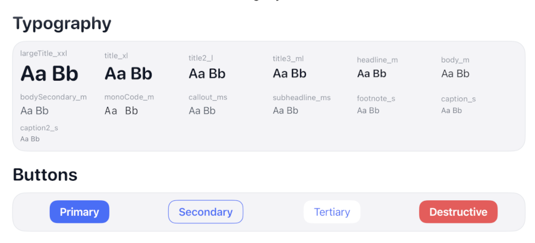
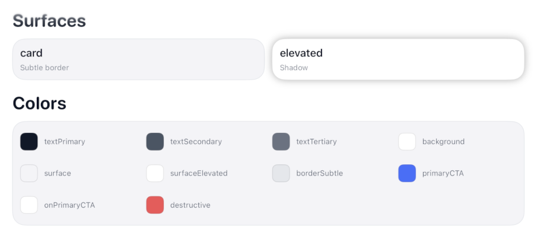

# GentleDesignSystem


A lightweight, token-driven SwiftUI design system with built-in Dark Mode and Dynamic Type support.

GentleDesignSystem is designed to feel *native*, *predictable*, and *composable*, while still giving you a centralized place to evolve typography, color, spacing, and surface behavior over time.

**See it in action:** Open `Demo/GentleDesignSystemDemo.xcodeproj` to explore all components.




---

## Quick Start

### 1. Add the Package

```swift
.package(url: "https://github.com/your-repo/GentleDesignSystem.git", branch: "main")
```

### 2. Wrap Your App Root

```swift
import GentleDesignSystem

@main
struct MyApp: App {
    var body: some Scene {
        WindowGroup {
            GentleThemeRoot(theme: .default) {
                ContentView()
            }
        }
    }
}
```

### 3. Use the Components

#### Typography
```swift
Text("Welcome")
    .gentleText(.title_xl)

Text("Description")
    .gentleText(.body_m, colorRole: .textSecondary)
```

#### Buttons
```swift
Button("Continue") { }
    .gentleButton(.primary)

Button("Cancel") { }
    .gentleButton(.secondary)
```

#### Surfaces
```swift
VStack {
    Text("Card content")
}
.gentleSurface(.card)
```

---

## Architecture Overview

GentleDesignSystem is intentionally structured around **three layers**:

1. **Token Definitions (Codable, JSON-friendly)**
2. **Runtime Resolution (Theme + Environment)**
3. **SwiftUI Ergonomics (Modifiers & Extensions)**

This separation keeps design intent clear, runtime behavior predictable, and future evolution safe.

---

## 1. Token Layer (Design-Time)

The token layer defines *what* your design system means — not how it is rendered.

### Token Categories

- **Typography**
  - `GentleTextRole`
  - `GentleTypographyRoleSpec`
- **Colors**
  - `GentleColorRole`
  - `GentleColorPair`
- **Spacing**
  - `GentleSpacingTokens`
- **Radii**
  - `GentleRadiusTokens`
- **Shadows**
  - `GentleShadowTokens`

All tokens are:
- `Codable`
- `Sendable`
- JSON-friendly

This makes it easy to:
- Persist themes
- Load themes remotely
- Share tokens across platforms later

```swift
public struct GentleDesignSystemSpec {
    public var colors: GentleColorTokens
    public var typography: GentleTypographyTokens
    public var spacing: GentleSpacingTokens
    public var radii: GentleRadiusTokens
    public var shadows: GentleShadowTokens
}
```

The default theme (`.gentleDefault`) is simply one concrete spec.

---

## 2. Runtime Layer (Theme Resolution)

At runtime, tokens are resolved into **actual SwiftUI values**.

### GentleTheme

`GentleTheme`:
- Owns a `GentleDesignSystemSpec`
- Resolves:
  - Colors per `ColorScheme`
  - Fonts per `ContentSizeCategory` (Dynamic Type)

```swift
@Environment(\.gentleTheme) var theme
```

Typography resolution uses `UIFontMetrics` to correctly scale custom font sizes while remaining anchored to Apple’s semantic text styles.

This ensures:
- Accessibility scaling works correctly
- Custom point sizes remain proportional
- Future Dynamic Type changes remain safe

---

## 3. Environment Injection

### Why `GentleThemeRoot` Exists

SwiftUI environments flow **top-down**.

By wrapping your app root with:

```swift
GentleThemeRoot {
    ContentView()
}
```

you ensure that:

- All child views receive the same theme
- Previews behave consistently
- Theme overrides are easy later (per scene, per feature, per preview)

`GentleThemeRoot` is intentionally lightweight — it only injects a single environment value.

This avoids:
- Global singletons
- Static state
- Implicit magic

---

## 4. Modifiers & View Extensions

GentleDesignSystem exposes *ergonomic APIs* while keeping logic centralized.

### Text

```swift
Text("Hello")
    .gentleText(.headline_m)
```

Internally:
- Resolves typography via `GentleTheme`
- Applies font, width, design, spacing, color
- Honors Dynamic Type automatically

### Surfaces

```swift
VStack { ... }
    .gentleSurface(.card)
```

Surfaces apply:
- Background color
- Padding (when appropriate)
- Corner radius
- Borders or shadows

The role-based API avoids “magic numbers” leaking into views.

### Buttons

```swift
Button("Save") { }
    .gentleButton(.primary)
```

Buttons are:
- Styled via `ButtonStyle`
- Fully theme-driven
- Easily extendable for new roles

---

## Available Tokens

### Typography Roles

| Role | Ramp |
|-----|------|
| `largeTitle_xxl` | XXL |
| `title_xl` | XL |
| `title2_l` | L |
| `title3_ml` | ML |
| `headline_m` | M |
| `body_m` | M |
| `bodySecondary_m` | M |
| `monoCode_m` | M |
| `callout_ms` | MS |
| `subheadline_ms` | MS |
| `footnote_s` | S |
| `caption_s` | S |
| `caption2_s` | S |

### Button Roles

- `primary`
- `secondary`
- `tertiary`
- `destructive`

### Surface Roles

- `appBackground`
- `card`
- `cardChrome`
- `cardElevated`
- `surfaceOverlay`

### Color Roles

- `textPrimary`
- `textSecondary`
- `textTertiary`
- `background`
- `surface`
- `surfaceElevated`
- `surfaceOverlay`
- `borderSubtle`
- `primaryCTA`
- `onPrimaryCTA`
- `destructive`
- `themePrimary`
- `themeSecondary`

### Spacing Tokens

| Token | Value |
|------|-------|
| `xs` | 4 |
| `s` | 8 |
| `m` | 12 |
| `l` | 16 |
| `xl` | 24 |
| `xxl` | 32 |

### Radius Tokens

| Token | Value |
|------|-------|
| `small` | 8 |
| `medium` | 12 |
| `large` | 20 |
| `pill` | 999 |

---

## Requirements

- iOS 26.0+
- Swift 6+

---

## 🤖 Tooling Note

Portions of drafting and editorial refinement in this repository were accelerated using large language models (including ChatGPT, Claude, and Gemini) under direct human design, validation, and final approval. All technical decisions, code, and architectural conclusions are authored and verified by the repository maintainer.
