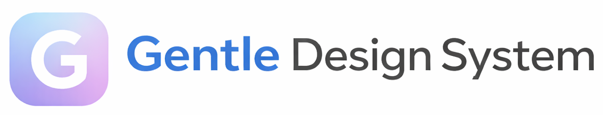
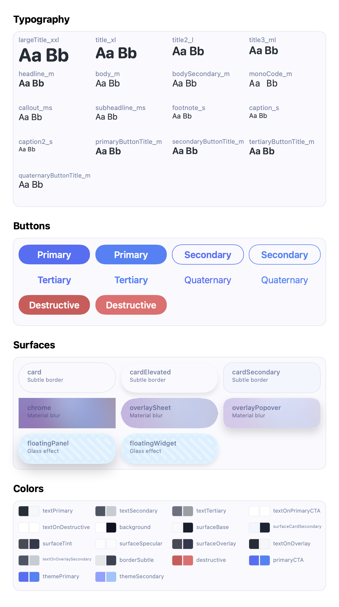

[](https://github.com/gentle-giraffe-apps/GentleDesignSystem/actions/workflows/ci.yml)
[](https://codecov.io/gh/gentle-giraffe-apps/GentleDesignSystem)
[](https://swift.org)


[](https://deepsource.io/) 
[](https://app.deepsource.com/gh/gentle-giraffe-apps/GentleDesignSystem/) 


> 🌍 **Language** · Canonical docs in English · [Español](Docs/README.es.md) · [Português (Brasil)](Docs/README.pt-BR.md) · [日本語](Docs/README.ja.md) · [简体中文](Docs/README.zh-CN.md) · [한국어](Docs/README.ko.md) · [Русский](Docs/README.ru.md)

### TLDR

Quickly standardize text, buttons, and surfaces with a unified design system.

```swift
Text("Simple modifiers")
    .gentleText(.title_xl)

Button("Across your app") { }
    .gentleButton(.primary)

VStack {
    Text("Save so much time")
}
.gentleSurface(.card)
```

### Built for

Apps that want a strong SwiftUI foundation with long-term theme evolution.

💬 **[Join the discussion. Feedback and questions welcome](https://github.com/gentle-giraffe-apps/GentleDesignSystem/discussions)**



**See it in action:** Open `Demo/GentleDesignSystemDemo.xcodeproj` to explore the components. The demo app also supports editing and sharing JSON specs via the system Share Sheet.

---

## Quick Start

### 1. Add the Package

```swift
.package(url: "https://github.com/gentle-giraffe-apps/GentleDesignSystem.git", from: "0.1.7")
```

### 2. Wrap Your App Root

```swift
import GentleDesignSystem

@main
struct MyApp: App {
    var body: some Scene {
        WindowGroup {
            GentleThemeRoot(theme: .default) {
                ContentView()
            }
        }
    }
}
```

### 3. Use the Components

#### Typography
```swift
Text("Welcome")
    .gentleText(.title_xl)

Text("Description")
    .gentleText(.body_m, colorRole: .textSecondary)
```

#### Buttons
```swift
Button("Continue") { }
    .gentleButton(.primary)

Button("Cancel") { }
    .gentleButton(.secondary)
```

#### Surfaces
```swift
VStack {
    Text("Card content")
}
.gentleSurface(.card)
```

---

## Quality & Tooling

<details>
  <summary><strong>CI, static analysis, and coverage details</strong></summary>

  This project enforces quality gates via CI and static analysis:

  - **CI:** All commits to `main` must pass GitHub Actions checks
  - **Static analysis:** DeepSource runs on every commit
  - **Test coverage:** Codecov reports line coverage

  <sub><strong>Codecov Snapshot</strong></sub><br/>
  <a href="https://codecov.io/gh/gentle-giraffe-apps/GentleDesignSystem">
    
  </a>

</details>

---

## Architecture Overview

GentleDesignSystem is intentionally structured around **three layers**:

1. **Token Definitions (Codable, JSON-friendly)**
2. **Runtime Resolution (Theme + Environment)**
3. **SwiftUI Ergonomics (Modifiers & Extensions)**

This separation keeps design intent clear, runtime behavior predictable, and future evolution safe.

<details>
  <summary><strong>System Architecture (diagram)</strong></summary>

  ```mermaid
  flowchart TB
      subgraph Tokens["Token Layer (Design-Time)"]
          Spec[GentleDesignSystemSpec]
          Spec --> Colors[GentleColorTokens]
          Spec --> Typography[GentleTypographyTokens]
          Spec --> Layout[GentleLayoutTokens]
          Spec --> Visual[GentleVisualTokens]
          Spec --> Buttons[GentleButtonTokens]
          Spec --> Surfaces[GentleSurfaceTokens]
      end

      subgraph Runtime["Runtime Layer"]
          Theme[GentleTheme]
          Manager[GentleThemeManager]
          Store[GentleFileThemeSpecStore]
          Manager --> Theme
          Store -.->|load/save| Manager
      end

      subgraph SwiftUI["SwiftUI Layer"]
          Root[GentleThemeRoot]
          Env[Environment Values .gentleTheme]
          Modifiers[View Modifiers]
          Root --> Env
          Env --> Modifiers
      end

      Tokens --> Runtime
      Runtime --> SwiftUI
  ```
</details>

<details>
  <summary><strong>Data Flow (diagram)</strong></summary>

  ```mermaid
  flowchart TB
      JSON[(JSON File)] -->|load| Store[GentleFileThemeSpecStore]
      Store --> Manager[GentleThemeManager]
      Manager --> Theme[GentleTheme]
      Theme --> Resolve{Resolution}

      Resolve -->|ColorScheme| ResolvedColor[Color]
      Resolve -->|ContentSizeCategory| ResolvedFont[Font]

      ResolvedColor --> View[SwiftUI View]
      ResolvedFont --> View

      View -->|.gentleText| Text
      View -->|.gentleButton| Button
      View -->|.gentleSurface| Surface
  ```
</details>

<details>
  <summary><strong>Data Model (spec structure)</strong></summary>

  The design system is defined by a single JSON-friendly specification
  (`GentleDesignSystemSpec`).

  ```text
  GentleDesignSystemSpec
│
├── colors: GentleColorTokens
│       │
│       └── pairByRole: [String: GentleColorPair]
│               │
│               ├── key = GentleColorRole.rawValue
│               └── value = GentleColorPair
│                       ├── lightHex: String
│                       └── darkHex:  String
│
├── typography: GentleTypographyTokens
│       │
│       └── roles: [String: GentleTypographyRoleSpec]
│               │
│               ├── key = GentleTextRole.rawValue
│               └── value = GentleTypographyRoleSpec
│                       ├── pointSize: Double
│                       ├── weight: GentleFontWeightToken
│                       ├── design: GentleFontDesignToken
│                       ├── width:  GentleFontWidthToken?
│                       ├── relativeTo: GentleFontTextStyle
│                       ├── lineSpacing: Double
│                       ├── letterSpacing: Double
│                       ├── isUppercased: Bool
│                       └── colorRole: GentleColorRole
│
├── layout: GentleLayoutTokens
│       │
│       ├── scale: GentleSpacingScaleTokens
│       │       ├── xs / s / m / l / xl / xxl : Double
│       │       └── value(for: GentleSpacingToken) -> Double
│       │
│       ├── gap:   GentleGapTokens
│       ├── grid:  GentleGridSpacingTokens
│       ├── touch: GentleTouchTokens
│       │
│       └── inset: GentleInsetTokens
│               │
│               └── tokensByRole: [String: GentleAxisInsetTokens]
│                       │
│                       ├── key = GentleInsetRole.rawValue
│                       └── value = GentleAxisInsetTokens
│                               ├── horizontal: GentleSpacingToken
│                               └── vertical:   GentleSpacingToken
│
├── visual: GentleVisualTokens
│       │
│       ├── radii: GentleRadiusTokens
│       │       ├── small:  Double
│       │       ├── medium: Double
│       │       ├── large:  Double
│       │       └── pill:   Double
│       │
│       └── shadows: GentleShadowTokens
│               ├── none:   Double
│               ├── small:  Double
│               └── medium: Double
│
├── buttons: GentleButtonTokens
│       │
│       ├── roles: [String: GentleButtonRoleSpec]
│       │       │
│       │       ├── key = GentleButtonRole.rawValue
│       │       └── value = GentleButtonRoleSpec
│       │               ├── shape: GentleButtonShape
│       │               ├── fillRole: GentleButtonFillRole
│       │               ├── borderRole: GentleButtonBorderRole
│       │               ├── animationRole: GentleButtonAnimationRole
│       │               ├── pressedScale: Double
│       │               ├── pressedOpacity: Double
│       │               └── usesNativeStyle: Bool
│       │
│       └── animations: [String: GentleButtonAnimationSpec]
│               │
│               ├── key = GentleButtonAnimationRole.rawValue
│               └── value = GentleButtonAnimationSpec
│                       ├── pressedScale: Double
│                       ├── pressedOpacity: Double
│                       ├── duration: Double
│                       ├── springResponse: Double
│                       ├── springDamping: Double
│                       └── springBlend: Double
│
└── surfaces: GentleSurfaceTokens
        │
        └── roles: [String: GentleSurfaceRoleSpec]
                │
                ├── key = GentleSurfaceRole.rawValue
                └── value = GentleSurfaceRoleSpec
                        ├── backgroundStyle: GentleSurfaceBackgroundStyle
                        │       ├── .solid(colorRole: GentleColorRole)
                        │       ├── .material(material:, tintColorRole:, tintOpacity:)
                        │       └── .glass(fallbackMaterial:, fallbackColorRole:)
                        ├── border: GentleColorPair
                        ├── cornerRadius: Double
                        ├── borderWidth: Double
                        ├── shadowRadius: Double
                        ├── shadowOpacity: Double
                        ├── shadowOffsetX: Double
                        └── shadowOffsetY: Double
  ```
</details>

> **Why roles instead of direct values?**  
> Roles provide stable identifiers that allow themes to evolve safely over time.
> Specs can change, presets can swap, and values can be overridden without
> breaking call sites or serialized themes.

---

## 1. Token Layer (Design-Time)

The token layer defines *what* your design system means — not how it is rendered.

### Token Categories

| Category | Types |
|----------|-------|
| **Typography** | `GentleTextRole`, `GentleTypographyRoleSpec`, `GentleTypographyTokens` |
| **Colors** | `GentleColorRole`, `GentleColorPair`, `GentleColorTokens` |
| **Layout** | `GentleLayoutTokens`, `GentleSpacingToken`, `GentleGapTokens`, `GentleInsetTokens` |
| **Visual** | `GentleVisualTokens`, `GentleRadiusTokens`, `GentleShadowTokens` |
| **Buttons** | `GentleButtonRole`, `GentleButtonRoleSpec`, `GentleButtonTokens`, `GentleButtonAnimationRole` |
| **Surfaces** | `GentleSurfaceRole`, `GentleSurfaceRoleSpec`, `GentleSurfaceTokens` |

<details>
  <summary><strong>Token guarantees & base spec</strong></summary>

  All tokens are:
  - `Codable`
  - `Sendable`
  - JSON-friendly

  This makes it easy to:
  - Persist themes
  - Load themes remotely
  - Share tokens across platforms later

  ```swift
public struct GentleDesignSystemSpec: Codable, Sendable {
    public var specVersion: String
    public var colors: GentleColorTokens
    public var typography: GentleTypographyTokens
    public var layout: GentleLayoutTokens
    public var visual: GentleVisualTokens
    public var buttons: GentleButtonTokens
    public var surfaces: GentleSurfaceTokens
}
  ```
</details>

The default theme (`.default`) is simply one concrete spec.

---

## 2. Runtime Layer (Theme Resolution)

At runtime, tokens are resolved into **actual SwiftUI values**.

### GentleTheme

`GentleTheme`:
- Owns a `GentleDesignSystemSpec`
- Resolves:
  - Colors per `ColorScheme`
  - Fonts per `ContentSizeCategory` (Dynamic Type)

```swift
@Environment(\.gentleTheme) var theme
```

Typography resolution uses `UIFontMetrics` to correctly scale custom font sizes while remaining anchored to Apple's semantic text styles.

This ensures:
- Accessibility scaling works correctly
- Custom point sizes remain proportional
- Future Dynamic Type changes remain safe

### Property Wrappers

<details>
  <summary><strong>Runtime access helpers</strong></summary>

  ```swift
// Access resolved theme values
@GentleDesignRuntime private var design

// Use in view
design.color(.textPrimary)    // Color for current scheme
design.layout.stack.regular   // CGFloat spacing value
design.buttons                // Button tokens
  ```
</details>

---

## 3. Environment Injection

### Why `GentleThemeRoot` Exists

SwiftUI environments flow **top-down**.

By wrapping your app root with:

```swift
GentleThemeRoot {
    ContentView()
}
```

you ensure that:

- All child views receive the same theme
- Previews behave consistently
- Theme overrides are easy later (per scene, per feature, per preview)

`GentleThemeRoot` is intentionally lightweight — it only injects a single environment value.

This avoids:
- Global singletons
- Static state
- Implicit magic

---

## 4. Modifiers & View Extensions

GentleDesignSystem exposes ergonomic APIs while keeping logic centralized.

<details>
  <summary><strong>Text modifiers</strong></summary>

  ```swift
Text("Hello")
    .gentleText(.headline_m)
  ```

  Internally:
  - Resolves typography via `GentleTheme`
  - Applies font, width, design, spacing, color
  - Honors Dynamic Type automatically

</details>

<details>
  <summary><strong>Surfaces</strong></summary>

  ```swift
  VStack { ... }
    .gentleSurface(.card)
  ```

  Surfaces apply:
  - Background color
  - Padding (when appropriate)
  - Corner radius
  - Borders or shadows

  The role-based API avoids "magic numbers" leaking into views.

</details>

<details>
  <summary><strong>Buttons</strong></summary>

  ```swift
Button("Save") { }
    .gentleButton(.primary)
  ```

  Buttons are:
  - Styled via `ButtonStyle`
  - Fully theme-driven
  - Support configurable animations
  - Easily extendable for new roles

</details>

---

## 5. Theme Management & Persistence

<details>
  <summary><strong>Runtime editing, persistence, and stores</strong></summary>
  
  **GentleThemeManager**

  ```swift
@main
struct MyApp: App {
    @State private var manager = GentleThemeManager(theme: .default)

    var body: some Scene {
        WindowGroup {
            GentleThemeRoot(theme: manager.theme) {
                ContentView()
            }
            .environment(\.gentleThemeManager, manager)
        }
    }
}
  ```

  **Using the Manager**

  ```swift
@GentleThemeManagerRuntime private var manager

// Save current theme to disk
try manager.save()

// Load persisted theme
try manager.load()

// Get bindings for editing
manager.typographyBinding(for: .body_m)
manager.colorBinding(for: .primaryCTA)
  ```

  **Persistence**

  `GentleFileThemeSpecStore` handles JSON persistence to Application Support:

  ```swift
let store = GentleFileThemeSpecStore(fileName: "my-theme.json")
let manager = GentleThemeManager(theme: .default, store: store)
  ```

</details>

---

## 6. Theme Presets

GentleDesignSystem includes 9 built-in theme presets, each designed for different use cases and aesthetics.

<details>
  <summary><strong>Available theme presets</strong></summary>

  ```swift
// Get all available presets
let presets = GentleDesignSystemSpec.allPresets

// Each preset provides:
// - name: Display name (e.g., "Gentle Default")
// - summary: Brief tagline
// - description: Detailed explanation
// - purpose: When to use this preset
// - systemImageString: SF Symbol name for UI
// - spec: The actual GentleDesignSystemSpec
  ```

| Preset | Summary | Best For |
|--------|---------|----------|
| **Gentle Default** | Calm, balanced foundation | Versatile starting point with clean hierarchy |
| **Classic Tan** | Warm, timeless with earthy tones | Apps benefiting from warmth and heritage |
| **Modern Gray** | Sleek, minimal with neutral foundations | Business apps where clarity is paramount |
| **Soft Green** | Fresh, natural with calming accents | Wellness, productivity, calm focus |
| **Editorial Paper** | Refined, print-inspired reading | Content-heavy apps, long-form reading |
| **Technical Blue** | Precise, trustworthy with blue highlights | Developer tools, dashboards |
| **Bold Orange** | Vibrant, energetic with strong presence | Apps that motivate action |
| **Elegant Purple** | Sophisticated, luxurious with rich tones | Lifestyle, creative, premium apps |
| **Compact Mint** | Dense, efficient with fresh accents | Data-rich interfaces |

</details>

### Using Presets

```swift
// Apply a preset to your theme manager
@GentleThemeManagerRuntime private var manager

// Find and apply a preset
if let editorialPreset = GentleDesignSystemSpec.allPresets.first(where: { $0.name == "Editorial Paper" }) {
    manager.theme.editableSpec = editorialPreset.spec
}
```

### Building a Theme Picker

The demo app includes a `ThemePickerView` that displays all presets as interactive cards. Each card previews the preset's typography and colors using the preset's own theme:

<details>
  <summary><strong>Building a theme picker</strong></summary>

  ```swift
ForEach(presets, id: \.name) { preset in
    let previewTheme = GentleTheme(
        defaultSpec: preset.spec,
        editableSpec: preset.spec
    )

    Button {
        themeManager.theme.editableSpec = preset.spec
    } label: {
        GentleThemeRoot(theme: previewTheme) {
            // Card content renders with the preset's own styling
            ThemePresetCard(preset: preset)
        }
    }
}
  ```

</details>


---

## Available Tokens

<details>
  <summary><strong>Typography roles</strong></summary>
  
  <br/>
  17 semantic text roles organized by size ramp (xxl > xl > l > ml > m > ms > s):  
  <br/>

| Ramp | Roles |
|------|-------|
| XXL | `largeTitle_xxl` |
| XL | `title_xl` |
| L | `title2_l` |
| ML | `title3_ml` |
| M | `headline_m`, `body_m`, `bodySecondary_m`, `monoCode_m`, `primaryButtonTitle_m`, `secondaryButtonTitle_m`, `tertiaryButtonTitle_m`, `quaternaryButtonTitle_m` |
| MS | `callout_ms`, `subheadline_ms` |
| S | `footnote_s`, `caption_s`, `caption2_s` |

  Each role resolves to a `GentleTypographyRoleSpec` containing: `pointSize`, `weight`, `design`, `width`, `relativeTo`, `lineSpacing`, `letterSpacing`, `isUppercased`, and `colorRole`.

</details>


<details>
  <summary><strong>Button roles & animations</strong></summary>
  
  **Button Roles**

  `primary` · `secondary` · `tertiary` · `quaternary` · `destructive` 
  
  **Button Animations**

| Animation | Description |
|-----------|-------------|
| `unknown` | No animation |
| `subtlePress` | Subtle press feedback |
| `squish` | Squish effect on press |
| `pop` | Pop effect |
| `bouncy` | Bouncy spring animation |
| `springBack` | Shrinks on press, springs back past original size before settling |

</details>

<details>
  <summary><strong>Surface roles</strong></summary>
  `appBackground` · `card` · `cardElevated` · `cardSecondary` · `chrome` · `overlaySheet` · `overlayPopover` · `overlayScrim` · `floatingPanel` · `floatingWidget`
</details>


<details>
  <summary><strong>Color roles</strong></summary>

| Category | Roles |
|----------|-------|
| Text (9) | `textPrimary`, `textSecondary`, `textTertiary`, `textOnPrimaryCTA`, `textOnDestructive`, `textOnOverlay`, `textOnOverlaySecondary`, `textOnScrim`, `textOnScrimSecondary` |
| Surfaces (6) | `background`, `surfaceBase`, `surfaceCardSecondary`, `surfaceTint`, `surfaceScrim`, `borderSubtle` |
| Actions (2) | `primaryCTA`, `destructive` |
| Theme (2) | `themePrimary`, `themeSecondary` |

Use semantic groupings: `GentleColorRole.textRoles`, `.surfaceRoles`, `.actionRoles`, `.themeRoles`
Use membership checks: `role.isTextRole`, `.isSurfaceRole`, `.isActionRole`, `.isThemeRole`

</details>

<details>
  <summary><strong>Spacing & radius tokens</strong></summary>

  **Spacing Tokens**
  `xs` (4) · `s` (8) · `m` (12) · `l` (16) · `xl` (24) · `xxl` (32)


  **Radius Tokens**
  `small` (8) · `medium` (12) · `large` (20) · `pill` (999)  

</details>

---

## Requirements

- iOS 18.0+
- Swift 6.1+

---

## Tooling Note

Portions of drafting and editorial refinement in this repository were accelerated using large language models (including ChatGPT, Claude, and Gemini) under direct human design, validation, and final approval. All technical decisions, code, and architectural conclusions are authored and verified by the repository maintainer.


